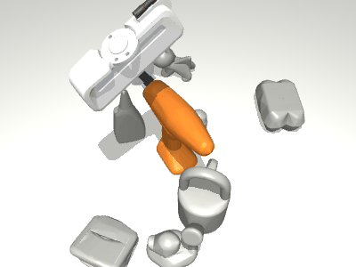
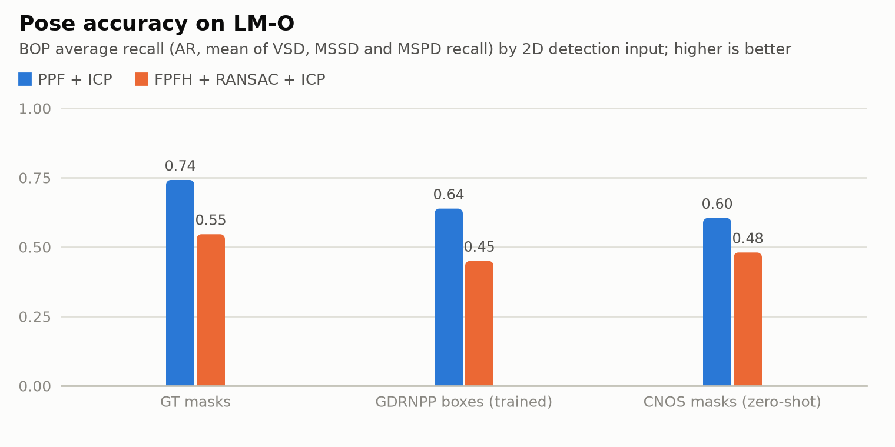
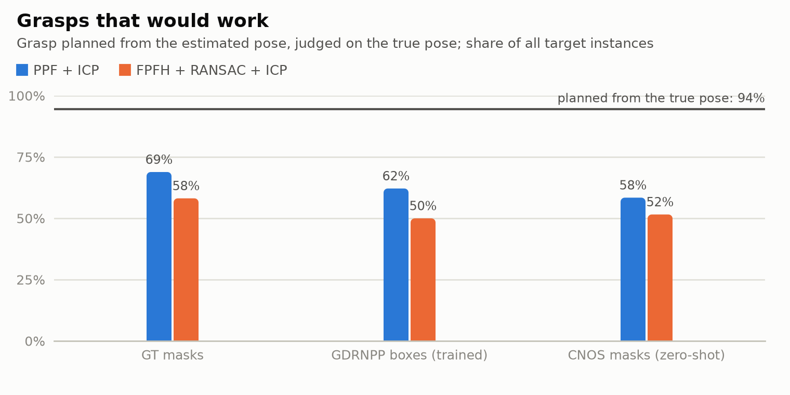
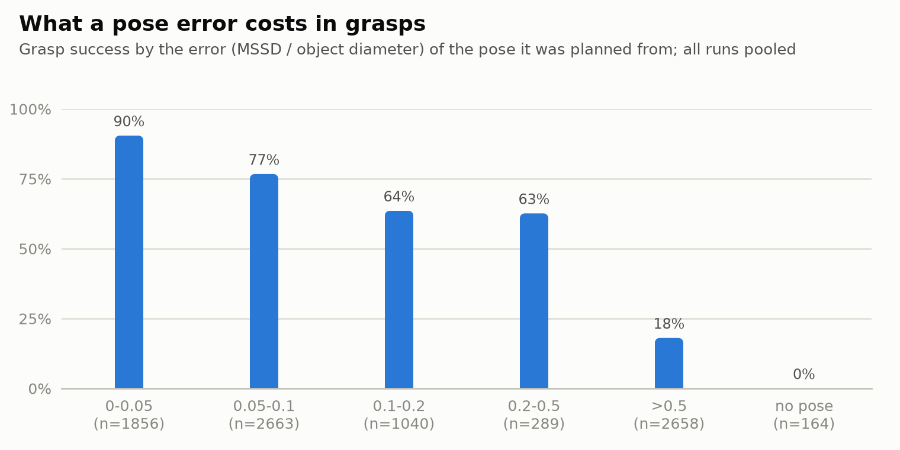
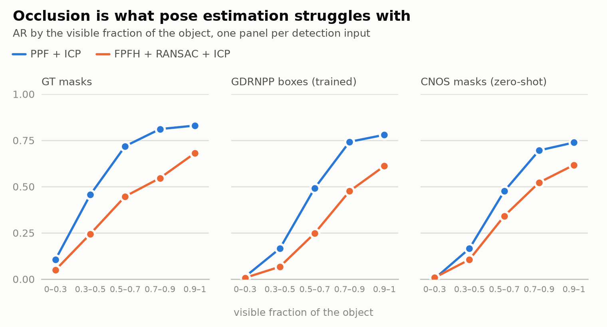
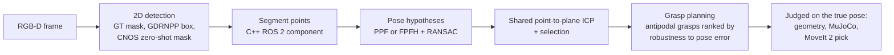

# posegrasp

**What does a pose error cost in picks?** posegrasp estimates the 6-DoF pose of known objects
from RGB-D, plans a parallel-jaw grasp from the pose, and checks whether the grasp would have
worked on the object where it really is: geometrically, in MuJoCo physics, and as a ROS 2 / MoveIt 2
pick. Every stage is measured on the public BOP benchmark (LM-O, 200 cluttered images, 1445
object instances) with the official metrics, on CPU only, by a GitHub Actions workflow anyone can
rerun.

[](https://github.com/GBR-RL/posegrasp/actions/workflows/ci.yml)
[](https://github.com/GBR-RL/posegrasp/actions/workflows/ros.yml)
[](https://github.com/GBR-RL/posegrasp/actions/workflows/benchmark.yml)

<p align="center"></p>

## Results

Full LM-O test set (BOP'19: 200 images, 1445 object instances), every number from one
[benchmark run](https://github.com/GBR-RL/posegrasp/actions/runs/36972675770) on free GitHub
runners. Full tables: [reports/benchmark/results.md](reports/benchmark/results.md).

| Pose method | 2D detections | Pose AR | Grasp success | Nominal ranking | Physics |
|---|---|---:|---:|---:|---:|
| PPF + ICP | true masks | **0.742** | **68.9 %** | 49.4 % | 69.6 % |
| PPF + ICP | GDRNPP boxes (trained) | 0.638 | 62.1 % | 44.2 % | 63.3 % |
| PPF + ICP | CNOS masks (zero-shot) | 0.604 | 58.4 % | 42.3 % | 58.3 % |
| FPFH + RANSAC + ICP | true masks | 0.546 | 58.1 % | 44.5 % | 61.7 % |
| FPFH + RANSAC + ICP | GDRNPP boxes (trained) | 0.450 | 50.0 % | 38.1 % | 51.7 % |
| FPFH + RANSAC + ICP | CNOS masks (zero-shot) | 0.480 | 51.6 % | 39.8 % | 52.4 % |
| *grasp planned from the true pose* | | | *94.4 %* | *94.3 %* | *81.7 %* |

*Pose AR*: the BOP Challenge score (mean recall of VSD, MSSD and MSPD). *Grasp success*: the
planned grasp, judged on the object at its true pose, over all instances (a missing pose is a
failure); *nominal ranking*: the same without accounting for pose errors. *Physics*: the same
grasps executed in MuJoCo.

- **A good pose score is not a good pick rate.** PPF with true masks gets 83.5 % of poses within
  10 % of the object size (ADD-S), yet only 49 % of the grasps planned naively from them would
  hold, against 94 % from the true pose.
- **Planning for the error wins most of it back.** Ranking grasps by how many small pose errors
  (3 mm, 3°) they tolerate raises grasp success by 12 to 20 points for every method and
  detector, and costs nothing when the pose is exact.
- **Even small errors cost picks.** Poses within 5 % of the object size still lose 10 % of their
  grasps (34 % with the nominal ranking); poses off by more than half the object size keep 18 %.
- **Occlusion is the main source of pose error**: PPF's AR falls from 0.83 for objects more
  than 90 % visible to 0.11 below 30 % visible.
- **PPF beats FPFH** by 0.12 to 0.20 AR and 7 to 12 points of grasp success, at a similar cost
  (median 0.40 s vs 0.33 s per object on a 4-core runner).
- **Physics agrees with the geometric test** on 78 to 82 % of the grasps planned from estimates,
  with success rates within 4 points. From exact poses the simulation is stricter (82 % vs
  94 %): objects slip out of the fingers during the lift, which the geometric test does not model.

<p>
<picture>
  <source media="(prefers-color-scheme: dark)" srcset="reports/benchmark/charts/pose_ar-dark.png">
  
</picture>
<picture>
  <source media="(prefers-color-scheme: dark)" srcset="reports/benchmark/charts/grasp_success-dark.png">
  
</picture>
<picture>
  <source media="(prefers-color-scheme: dark)" srcset="reports/benchmark/charts/success_by_error-dark.png">
  
</picture>
<picture>
  <source media="(prefers-color-scheme: dark)" srcset="reports/benchmark/charts/ar_by_visibility-dark.png">
  
</picture>
</p>

### How it fails


Blue: the object at its true pose; orange: the estimate.

## How it works



- **Pose estimation.** Two classical, training-free estimators share everything but their
  search: PPF (Drost et al., the strongest classical method of the first BOP challenge;
  OpenCV `surface_matching`) and FPFH features with RANSAC (Open3D). Both feed hypotheses to the
  same coarse-to-fine point-to-plane ICP; the best hypothesis is chosen by ICP fit or by
  rendering it and checking the measured depth.
- **Metrics.** The official BOP errors (VSD, MSSD, MSPD → average recall AR) and ADD(-S), each
  checked against the official `bop_toolkit` in the unit tests; results are also written in the
  BOP submission format.
- **Grasps.** Antipodal grasps for a Franka Hand are synthesised once per CAD model (friction
  cone, 80 mm stroke, self-collision) and scored for robustness: the share of small pose errors
  (3 mm, 3°) under which they still hold. In the scene they are moved by the estimated pose,
  checked against the depth points, and ranked.
- **Did it work?** The planned grasp is judged on the object at its *true* pose: the open hand
  must not collide, both fingers must close on the object, and the contacts must sit inside the
  friction cone. Every planned grasp is also executed in MuJoCo with the Franka Hand of MuJoCo
  Menagerie, and the ROS 2 stack plans and executes the full pick with MoveIt 2 for a Panda arm.
- **Rules.** Settings were chosen on 20 development images and frozen before the full run
  ([docs/EVAL_PROTOCOL.md](docs/EVAL_PROTOCOL.md), with a change log).

## ROS 2

`ros/` holds two ROS 2 Jazzy packages:

| Package | Language | What |
|---|---|---|
| `posegrasp_cpp` | C++ (rclcpp) | composable node: depth + detection masks → segment and scene point clouds, intra-process (`unique_ptr` publishing), gtest |
| `posegrasp_ros` | Python (rclpy) | BOP scene player (images, camera info, detections, TF), pose estimator (`vision_msgs/Detection3DArray` + TF), grasp planner (`PoseArray` + markers), MoveIt 2 pick node, launch files and launch tests |

```bash
colcon build --base-paths ros
ros2 launch posegrasp_ros pick.launch.py im_ids:=3 objects:=8 target_object:=8
```

The [ROS 2 workflow](.github/workflows/ros.yml) builds both packages in the `ros:jazzy`
container and runs `launch_testing`: one LM-O frame in, a pose within 5 % of the object size
and 5° out, and a planned and executed pick (open, pre-grasp, grasp, close, lift) with the Panda
on `ros2_control` mock hardware.

## Reproduce

```bash
python -m pip install -e ".[dev,plots,sim]"
posegrasp data                                   # LM-O + BOP'23 default detections, ~140 MB
posegrasp eval --estimator ppf --selection score --condition gt --subset all
posegrasp grasps                                 # antipodal grasps per object (cached)
posegrasp pick --method ppf-score --condition gt --subset all
posegrasp sim-assets                             # Franka hand + convex decompositions
posegrasp simulate --method ppf-score --condition gt --subset all
posegrasp report --subset all                    # tables, charts, BOP CSV files
```

Or run the whole benchmark on free GitHub runners: *Actions → Benchmark → Run workflow*
(45 jobs, two to four hours depending on runner availability); the report is attached to the
run as an artifact. *Actions → Report* rebuilds the report and the failure gallery from a
finished run.

## Layout

```
src/posegrasp/     data (BOP reader, detections), estimators, metrics, render, verify,
                   pipeline, grasp, picking, scene, sim, report, charts, gallery, cli
tests/             unit tests on synthetic data + tests on the real data
ros/               posegrasp_cpp (rclcpp component), posegrasp_ros (nodes, launch, tests)
docs/              EVAL_PROTOCOL.md, media/
reports/benchmark/ the committed report of the full run
```

## Limits

- One dataset (LM-O: 8 objects, one scene); classical estimators only, no learned ones (CPU).
- Pose errors are measured exactly; grasp success is a model: the gripper is three boxes for the
  geometric test, the physics check uses a floating hand rather than the arm, and objects other
  than the target stay fixed. The robot base is placed on the table plane fitted from the data
  (LM-O has no robot).
- FPFH's RANSAC is multi-threaded and not bit-reproducible across machines (dev AR varied by
  about 0.07 between a laptop and a CI runner); PPF varies by about 0.02.

## Data and credits

LM-O and the BOP'23 default detections (GDRNPP, CNOS) from the
[BOP benchmark](https://bop.felk.cvut.cz) (CC BY-SA 4.0); the Franka Hand model from
[MuJoCo Menagerie](https://github.com/google-deepmind/mujoco_menagerie) (Apache 2.0); the Panda
MoveIt configuration from `moveit_resources` (BSD). Code: MIT.
